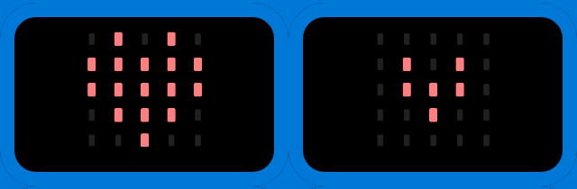
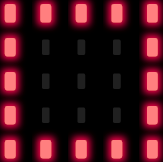

# Défis à relever sur [BBC micro:bit](https://ericecmorlaix.github.io/adn-Tutoriel_lab_si/IOT/BBC_microbit/){target=_blank}

## Smiley

Faire afficher un Smiley sur la matrice des 25 Leds...

{ .center}

## Coeur clignotant

Modifier le programme pour qu'après la phase de démarrage du BBC micro:bit la matrice de 25 LEDs affiche alternativement les 2 images de coeur suivantes :

{ .center}

> La fonction `sleep(t)` met en pause l’exécution pendant `t` millisecondes.  
> Exemple : `sleep(1000)` suspend l’exécution pendant 1 seconde.

## Badge interactif

Créer un badge interactif qui affiche un visage heureux si on appuie sur le bouton A, et un visage triste si on appuie sur le bouton B, ou un visage neutre sinon.

{ .center}

## Feux d'artifice

Créer une autre séquence animée simulant un feux d'artifice comme par exemple :

<figure>
<iframe width="560" height="315" src="https://www.youtube-nocookie.com/embed/uueiyRfRk7k" title="YouTube video player" frameborder="0" allow="accelerometer; autoplay; clipboard-write; encrypted-media; gyroscope; picture-in-picture" allowfullscreen></iframe>
</figure>

## Pluie

- Représenter une goutte d’eau qui tombe dans la 1ère colonne.

{ .center}

> La fonction `display.set_pixel(x,y,i)` permet d’allumer la LED de la colonne `x` (nombre entre 0 et 4) et de la ligne `y` (nombre entre 0 et 4) avec une intensité `i` (nombre entre 0 et 9).  
> Exemple : `display.set_pixel(1,2,9)` allume la LED située à la colonne 1 de la ligne 2 avec l’intensité 9.

- Faire tomber dix gouttes de suite dans la 1ère colonne.

- Faire tomber une goutte une fois dans chaque colonne.

{ .center}

- Faire tomber dix fois une goutte de pluie dans des colonnes choisies aléatoirement.

> La fonction `randint(x,y)` retourne un nombre entier aléatoire compris entre les nombres entiers x et y inclus. Pour pourvoir utiliser cette fonction, il faut ajouter from random import * au début du programme.  
> Exemple: `randint(0,10)` retourne un nombre aléatoire compris entre 0 et 10.

## Pierre, feuille, ciseau

Développer un programme pour qu'après avoir été secoué la carte BBC micro:bit affiche de façon aléatoire l'un des trois symboles suivants correspondant respectivement à une feuille, une pierre, ou des ciseaux.

{ .center}
{ .center}
{ .center}

## Musique

Programmer votre BBC micro:bit pour jouer la musique du thème de "Star Wars"...

{width=60% .center}

## Autres défis

Essayer d'autres choses en vous inspirant par exemple de :

<ul>
    <li>
      <a href="https://projects.raspberrypi.org/fr-FR/projects/interactive-badge">Badge Interactif</a>
    </li>
    <li>
      <a href="https://projects.raspberrypi.org/fr-FR/projects/frustration">Frustration</a>
    </li>
    <li>
      <a href="https://projects.raspberrypi.org/fr-FR/projects/fortune-teller">Diseuse de bonne aventure</a>
    </li>
    <li>
      <a href="https://projects.raspberrypi.org/fr-FR/projects/against-the-clock">Contre la montre</a>
    </li>
    <li>
      <a href="https://projects.raspberrypi.org/fr-FR/projects/rate-your-mates">Note tes potes</a>
    </li>
    <li>
      <a href="https://projects.raspberrypi.org/fr-FR/projects/reaction">Réflexes</a>
    </li>
  </ul>  

## Prolongements

Pour aller plus loins en programmation Python avec la carte BBC micro:bit :

- <https://matthieu-branthome.github.io/activite/#d%C3%A9fi-1-le-smiley>

<!-- 
http://2si.si.lycee.ecmorlaix.fr/Robotique/BBCmicrobit.html
 -->

