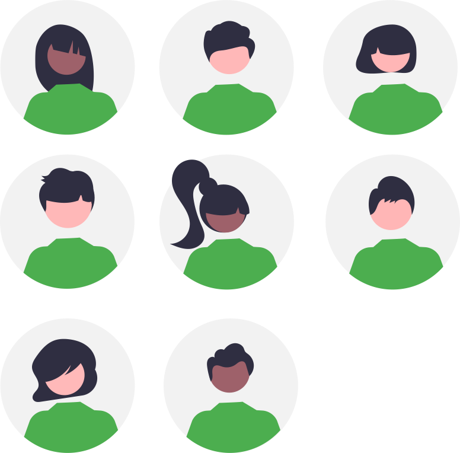

{: .center width=50%}

## Avertissement :

[{: align=left width=10%}](){target=_blank}[{: align=right width=10%}](mailto:)Ce site s'adresse aux élèves de seconde du lycée Notre Dame du Mur qui suivent l'enseignement de découverte des Sciences de l'Ingénieur.

## Contenu de formation :

- **Explorer** à travers différentes activités courtes le domaine des Sciences de l'Ingénieur :  

    - simulation et expérimentation de systèmes ;
    - programmation de cartes à microcontrôleur ;
    - modélisation et impression 3D...

{: .center width=50%}

[mail]: mailto:eric.madec@ecmorlaix.fr "eric.madec@ecmorlaix.fr"

<!-- ***

## Le 07/03

=== "CONTENU DE SÉANCE"

    - **Prise en main** de la programmation des Lego Mindstorms EV3 avec l'application : "EV3 Classroom" :
        1. **Hello !** => expérimenter afin d'expliquer comment fonctionne la communication avec la brique depuis une tablette et depuis un PC...  ;
        2. **Moteurs et capteurs** => programmer les différents capteurs et moteurs disponibles afin d'expliquer leur fonctionnement... ;
        3. **Se déplacer** => construire et programmer une base motrice afin d'expliquer le déplacement produit par les différentes instructions... ;
        4. **Fichier > Nouveau Projet**  =>  créer une nouvelle trame de programmation personnalisée et la partager...

=== "TRAVAIL À FAIRE"

    {: .center width=40%}

    - **Faire** la [mise à jour d'Obsidian pour découvrir les canvas](https://ericecmorlaix.github.io/adn-Tutoriel_Obsidian/7-Options_Plugins/#canvas){target=_blank} ;
    - **Finir** les [activités d'escape game pour l'accueil des troisièmes](https://ericecmorlaix.github.io/accueil_3/){target=_blank} ;
    - **Poursuivre**, avec votre code personnel, la programmation des objets connectés sur la [plateforme de France-IOI​​](https://amazon.quick-pi.org/){target="_blank"} ;
    - **Découvrir** d'avantage la [modélisation 3D avec BlocksCad](./blocksCAD){target="_blank"} ;    
    - **Simuler** une carte [BBC micro:bit](./bbc_microbit){target=_blank} ;
    - **Jouer** à résoudre le Casse Tête en ligne [ici (code JavaScript)](http://isn.si.lycee.ecmorlaix.fr/casseTete/){target=_blank} ou encore [là (code Scratch)](https://scratch.mit.edu/projects/179937454/){target=_blank} ;

***

## Le 28/02

=== "CONTENU DE SÉANCE"

    - **Réaliser** les [activités d'escape game pour l'accueil des troisièmes](https://ericecmorlaix.github.io/accueil_3/){target=_blank} ;

=== "TRAVAIL À FAIRE"

    - **Faire** la [mise à jour d'Obsidian pour découvrir les canvas](https://ericecmorlaix.github.io/adn-Tutoriel_Obsidian/7-Options_Plugins/#canvas){target=_blank} ;

***
## Du 31/01 au 06/02

=== "CONTENU DE SÉANCE"

    - Seconde synthèse de la programmation des objets connectés sur la [plateforme de France-IOI​​](https://amazon.quick-pi.org/){target="_blank"} et avec le notebook [Quick_Pi-Objets_connectes-Parcours_1.ipynb](https://nbviewer.org/urls/ericecmorlaix.github.io/2SI_2022-2023/Quick_Pi-Objets_connectes-Parcours_1.ipynb){target=_blank} [:fontawesome-solid-download:](https://ericecmorlaix.github.io/2SI_2022-2023/Quick_Pi-Objets_connectes-Parcours_1.ipynb){ .md-button .md-button--primary} ;
    
    - Seconde synthèse de la modélisation 3D avec [BlocksCAD](./blocksCAD){target="_blank"} -> ==**Défin n°2 : Modéliser un support imprimable**== ;

    - **Programmer** une carte [BBC micro:bit](./bbc_microbit){target=_blank} ;

=== "TRAVAIL À FAIRE"

    {: .center width=40%}

    - **Découvrir** [Ces 12 "jobs du futur" qui vont exploser](https://start.lesechos.fr/travailler-mieux/classements/ces-12-jobs-du-futur-qui-vont-exploser-1174984?xtor=CS2-11) ;
    - **Lire** les pages de présentation des spécialités [Siences de l'Ingénieur](http://si.lycee.ecmorlaix.fr/){target=_blank} et [Numérique et Siences Informatiques](http://si.lycee.ecmorlaix.fr/nsi){target=_blank} ;    
    - **Poursuivre**, avec votre code personnel, la programmation des objets connectés sur la [plateforme de France-IOI​​](https://amazon.quick-pi.org/){target="_blank"} ;
    - **Découvrir** d'avantage la [modélisation 3D avec BlocksCad](./blocksCAD){target="_blank"} ;    
    - **Simuler** une carte [BBC micro:bit](./bbc_microbit){target=_blank} ;
    - **Jouer** à résoudre le Casse Tête en ligne [ici (code JavaScript)](http://isn.si.lycee.ecmorlaix.fr/casseTete/){target=_blank} ou encore [là (code Scratch)](https://scratch.mit.edu/projects/179937454/){target=_blank} ;
   

***
## Le 24/01

=== "CONTENU DE SÉANCE"

    - Première synthèse de la programmation des objets connectés sur la [plateforme de France-IOI​​](https://amazon.quick-pi.org/){target="_blank"} et avec le notebook [Quick_Pi-Objets_connectes-Parcours_1.ipynb](https://nbviewer.org/urls/ericecmorlaix.github.io/2SI_2022-2023/Quick_Pi-Objets_connectes-Parcours_1.ipynb){target=_blank} [:fontawesome-solid-download:](https://ericecmorlaix.github.io/2SI_2022-2023/Quick_Pi-Objets_connectes-Parcours_1.ipynb){ .md-button .md-button--primary} ;
    
    
    - **S'initier** à la modélisation 3D avec [BlocksCAD](./blocksCAD){target="_blank"} ;

    - Première synthèse de la modélisation 3D avec [BlocksCAD](./blocksCAD){target="_blank"} ==**-> Impression 3D d'un pion**== ;

=== "TRAVAIL À FAIRE"

    {: .center width=40%}

    - **Découvrir** [Ces 12 "jobs du futur" qui vont exploser](https://start.lesechos.fr/travailler-mieux/classements/ces-12-jobs-du-futur-qui-vont-exploser-1174984?xtor=CS2-11) ;

    - **Poursuivre**, avec votre code personnel, la programmation des objets connectés sur la [plateforme de France-IOI​​](https://amazon.quick-pi.org/){target="_blank"} ;

    - **Découvrir** d'avantage la [modélisation 3D avec BlocksCad](./blocksCAD){target="_blank"} ;

   
     -->
<!-- ## Les 30/05 et 06/06

=== "CONTENU DE SÉANCE"

    Réaliser une petite application utilisant :

    - la modélisation 3D avec [BlocksCAD](./blocksCAD){target="_blank"} ;
    - la programmation d'une carte [BBC micro:bit](./bbc_microbit){target=_blank} ;

=== "TRAVAIL À FAIRE"

    {: .center width=40%}

    - **Découvrir** [Ces 12 "jobs du futur" qui vont exploser](https://start.lesechos.fr/travailler-mieux/classements/ces-12-jobs-du-futur-qui-vont-exploser-1174984?xtor=CS2-11) ;
    - **Lire** les pages de présentation des spécialités [Siences de l'Ingénieur](http://si.lycee.ecmorlaix.fr/){target=_blank} et [Numérique et Siences Informatiques](http://si.lycee.ecmorlaix.fr/nsi){target=_blank} ;    
    - **Poursuivre**, avec votre code personnel, la programmation des objets connectés sur la [plateforme de France-IOI​​](https://amazon.quick-pi.org/){target="_blank"} et compléter progressivement votre notebook [Quick_Pi-Objets_connectes-Parcours_1.ipynb](https://nbviewer.org/urls/ericecmorlaix.github.io/2SI_2022-2023/Quick_Pi-Objets_connectes-Parcours_1.ipynb){target=_blank} [:fontawesome-solid-download:](https://ericecmorlaix.github.io/2SI_2022-2023/Quick_Pi-Objets_connectes-Parcours_1.ipynb){ .md-button .md-button--primary} ;
    - **Simuler** une carte [BBC micro:bit](./bbc_microbit){target=_blank} ;
    - **Découvrir** d'avantage la [modélisation 3D avec BlocksCad](./blocksCAD){target="_blank"} ;   

***

***
## Le 09/05

=== "CONTENU DE SÉANCE"

    - **S'initier** à la modélisation 3D avec [BlocksCAD](./blocksCAD){target="_blank"} ;
    - **Poursuivre** la programmation d'une carte [BBC micro:bit](./bbc_microbit){target=_blank} ;

=== "TRAVAIL À FAIRE"

    {: .center width=40%}

    - **Découvrir** [Ces 12 "jobs du futur" qui vont exploser](https://start.lesechos.fr/travailler-mieux/classements/ces-12-jobs-du-futur-qui-vont-exploser-1174984?xtor=CS2-11) ;
    - **Lire** les pages de présentation des spécialités [Siences de l'Ingénieur](http://si.lycee.ecmorlaix.fr/){target=_blank} et [Numérique et Siences Informatiques](http://si.lycee.ecmorlaix.fr/nsi){target=_blank} ;    
    - **Poursuivre**, avec votre code personnel, la programmation des objets connectés sur la [plateforme de France-IOI​​](https://amazon.quick-pi.org/){target="_blank"} et compléter progressivement votre notebook [Quick_Pi-Objets_connectes-Parcours_1.ipynb](https://nbviewer.org/urls/ericecmorlaix.github.io/2SI_2022-2023/Quick_Pi-Objets_connectes-Parcours_1.ipynb){target=_blank} [:fontawesome-solid-download:](https://ericecmorlaix.github.io/2SI_2022-2023/Quick_Pi-Objets_connectes-Parcours_1.ipynb){ .md-button .md-button--primary} ;
    - **Simuler** une carte [BBC micro:bit](./bbc_microbit){target=_blank} ;
    - **Découvrir** d'avantage la [modélisation 3D avec BlocksCad](./blocksCAD){target="_blank"} ;   

***
## Le 02/05

=== "CONTENU DE SÉANCE"

    - **Programmer** une carte [BBC micro:bit](./bbc_microbit){target=_blank} ;

=== "TRAVAIL À FAIRE"

    {: .center width=40%}

    - **Découvrir** [Ces 12 "jobs du futur" qui vont exploser](https://start.lesechos.fr/travailler-mieux/classements/ces-12-jobs-du-futur-qui-vont-exploser-1174984?xtor=CS2-11) ;
    - **Lire** les pages de présentation des spécialités [Siences de l'Ingénieur](http://si.lycee.ecmorlaix.fr/){target=_blank} et [Numérique et Siences Informatiques](http://si.lycee.ecmorlaix.fr/nsi){target=_blank} ;    
    - **Poursuivre**, avec votre code personnel, la programmation des objets connectés sur la [plateforme de France-IOI​​](https://amazon.quick-pi.org/){target="_blank"} et compléter progressivement votre notebook [Quick_Pi-Objets_connectes-Parcours_1.ipynb](https://nbviewer.org/urls/ericecmorlaix.github.io/2SI_2022-2023/Quick_Pi-Objets_connectes-Parcours_1.ipynb){target=_blank} [:fontawesome-solid-download:](https://ericecmorlaix.github.io/2SI_2022-2023/Quick_Pi-Objets_connectes-Parcours_1.ipynb){ .md-button .md-button--primary} ;
    - **Simuler** une carte [BBC micro:bit](./bbc_microbit){target=_blank} ;   

***
## Les 04 et 11/04

=== "CONTENU DE SÉANCE"

    - Remédiation [Prise en main d'Obsidian](https://ericecmorlaix.github.io/adn-Tutoriel_Obsidian/){target="_blank"} pour communiquer un compte rendu ;    

    - **S'initier** à la programmation des objets connectés avec la carte [**QuickPi**](https://quick-pi.org/){target="_blank"} :
        - à partir de la plateforme [**Castor Informatique France-IOI**](https://concours.castor-informatique.fr/){target="_blank"}​ en utilisant le code `rndiwfdk` fourni​​​ pour débuter le **Parcours_1** ;
        - **regardez** la [vidéo de prise en main de l'interface](https://web.microsoftstream.com/video/3d15c5a0-a510-4553-a45c-892de0227100){target="_blank"} ;
        - ==**notez, transmettez-moi et conservez** votre code personnel pour ce Parcours pour y retourner d'une fois sur l'autre== ;

=== "TRAVAIL À FAIRE"

    {: .center width=40%}

    - **Découvrir** [Ces 12 "jobs du futur" qui vont exploser](https://start.lesechos.fr/travailler-mieux/classements/ces-12-jobs-du-futur-qui-vont-exploser-1174984?xtor=CS2-11) ;

    - **Poursuivre**, avec votre code personnel, la programmation des objets connectés sur la [plateforme de France-IOI​​](https://amazon.quick-pi.org/){target="_blank"} et compléter progressivement votre notebook [Quick_Pi-Objets_connectes-Parcours_1.ipynb](https://nbviewer.org/urls/ericecmorlaix.github.io/2SI_2022-2023/Quick_Pi-Objets_connectes-Parcours_1.ipynb){target=_blank} [:fontawesome-solid-download:](https://ericecmorlaix.github.io/2SI_2022-2023/Quick_Pi-Objets_connectes-Parcours_1.ipynb){ .md-button .md-button--primary} ;

    -->

<!-- ## Le 29/11

=== "CONTENU DE SÉANCE"

    - Synthèse "Instrument" (Salomé) de la programmation des objets connectés sur la [plateforme de France-IOI​​](https://amazon.quick-pi.org/){target="_blank"} et avec le notebook [Quick_Pi-Objets_connectes-Parcours_1.ipynb](https://nbviewer.org/urls/ericecmorlaix.github.io/2SI_2022-2023/Quick_Pi-Objets_connectes-Parcours_1.ipynb){target=_blank} [:fontawesome-solid-download:](https://ericecmorlaix.github.io/2SI_2022-2023/Quick_Pi-Objets_connectes-Parcours_1.ipynb){ .md-button .md-button--primary} ;    

    - **Prise en main** de la programmation des Lego Mindstorms EV3 avec l'application : "EV3 Classroom" :
        1. **Hello !** => expérimenter afin d'expliquer comment fonctionne la communication avec la brique depuis une tablette et depuis un PC...  ;
        2. **Moteurs et capteurs** => programmer les différents capteurs et moteurs disponibles afin d'expliquer leur fonctionnement... ;
        3. **Se déplacer** => construire et programmer une base motrice afin d'expliquer le déplacement produit par les différentes instructions... ;
        4. **Fichier > Nouveau Projet**  =>  créer une nouvelle trame de programmation personnalisée et la partager...

=== "TRAVAIL À FAIRE"

    {: .center width=40%}

    - Explorer d'avantage [les fonctionnalités de l'application multiplateforme Obsidian](https://ericecmorlaix.github.io/adn-Tutoriel_Obsidian/){target=_blank}

    - **Poursuivre**, avec votre code personnel, la programmation des objets connectés sur la [plateforme de France-IOI​​](https://amazon.quick-pi.org/){target="_blank"} et compléter progressivement votre notebook [Quick_Pi-Objets_connectes-Parcours_1.ipynb](https://nbviewer.org/urls/ericecmorlaix.github.io/2SI_2022-2023/Quick_Pi-Objets_connectes-Parcours_1.ipynb){target=_blank} [:fontawesome-solid-download:](https://ericecmorlaix.github.io/2SI_2022-2023/Quick_Pi-Objets_connectes-Parcours_1.ipynb){ .md-button .md-button--primary} ;
    - **Découvrir** d'avantage la [modélisation 3D avec BlocksCad](./blocksCAD){target="_blank"} ;
    - **Programmer** une carte [BBC micro:bit](./bbc_microbit){target=_blank} ;

***
## Le 22/11

=== "CONTENU DE SÉANCE"

    - Synthèse "Instrument" (Salomé), "Avertisseur" (Anna) de la programmation des objets connectés sur la [plateforme de France-IOI​​](https://amazon.quick-pi.org/){target="_blank"} et avec le notebook [Quick_Pi-Objets_connectes-Parcours_1.ipynb](https://nbviewer.org/urls/ericecmorlaix.github.io/2SI_2022-2023/Quick_Pi-Objets_connectes-Parcours_1.ipynb){target=_blank} [:fontawesome-solid-download:](https://ericecmorlaix.github.io/2SI_2022-2023/Quick_Pi-Objets_connectes-Parcours_1.ipynb){ .md-button .md-button--primary} ;    

    - **Programmer** une carte [BBC micro:bit](./bbc_microbit){target=_blank}

=== "TRAVAIL À FAIRE"

    {: .center width=40%}

    - Explorer d'avantage [les fonctionnalités de l'application multiplateforme Obsidian](https://ericecmorlaix.github.io/adn-Tutoriel_Obsidian/){target=_blank}

    - **Poursuivre**, avec votre code personnel, la programmation des objets connectés sur la [plateforme de France-IOI​​](https://amazon.quick-pi.org/){target="_blank"} et compléter progressivement votre notebook [Quick_Pi-Objets_connectes-Parcours_1.ipynb](https://nbviewer.org/urls/ericecmorlaix.github.io/2SI_2022-2023/Quick_Pi-Objets_connectes-Parcours_1.ipynb){target=_blank} [:fontawesome-solid-download:](https://ericecmorlaix.github.io/2SI_2022-2023/Quick_Pi-Objets_connectes-Parcours_1.ipynb){ .md-button .md-button--primary} ;

    - **Découvrir** d'avantage la [modélisation 3D avec BlocksCad](./blocksCAD){target="_blank"} ;

***
## Le 15/11

=== "CONTENU DE SÉANCE"

    - Synthèse "Instrument","Avertisseur", "Servo chronométré" de la programmation des objets connectés sur la [plateforme de France-IOI​​](https://amazon.quick-pi.org/){target="_blank"} et avec le notebook [Quick_Pi-Objets_connectes-Parcours_1.ipynb](https://nbviewer.org/urls/ericecmorlaix.github.io/2SI_2022-2023/Quick_Pi-Objets_connectes-Parcours_1.ipynb){target=_blank} [:fontawesome-solid-download:](https://ericecmorlaix.github.io/2SI_2022-2023/Quick_Pi-Objets_connectes-Parcours_1.ipynb){ .md-button .md-button--primary} ;    

    - **Programmer** une carte [BBC micro:bit](./bbc_microbit){target=_blank}

=== "TRAVAIL À FAIRE"

    {: .center width=40%}

    - Explorer d'avantage [les fonctionnalités de l'application multiplateforme Obsidian](https://ericecmorlaix.github.io/adn-Tutoriel_Obsidian/){target=_blank}

    - **Poursuivre**, avec votre code personnel, la programmation des objets connectés sur la [plateforme de France-IOI​​](https://amazon.quick-pi.org/){target="_blank"} et compléter progressivement votre notebook [Quick_Pi-Objets_connectes-Parcours_1.ipynb](https://nbviewer.org/urls/ericecmorlaix.github.io/2SI_2022-2023/Quick_Pi-Objets_connectes-Parcours_1.ipynb){target=_blank} [:fontawesome-solid-download:](https://ericecmorlaix.github.io/2SI_2022-2023/Quick_Pi-Objets_connectes-Parcours_1.ipynb){ .md-button .md-button--primary} ;

    - **Découvrir** d'avantage la [modélisation 3D avec BlocksCad](./blocksCAD){target="_blank"} ;

***
## Le 08/11

=== "CONTENU DE SÉANCE"

    - Synthèse "Show lumineux 2" de la programmation des objets connectés sur la [plateforme de France-IOI​​](https://amazon.quick-pi.org/){target="_blank"} et avec le notebook [Quick_Pi-Objets_connectes-Parcours_1.ipynb](https://nbviewer.org/urls/ericecmorlaix.github.io/2SI_2022-2023/Quick_Pi-Objets_connectes-Parcours_1.ipynb){target=_blank} [:fontawesome-solid-download:](https://ericecmorlaix.github.io/2SI_2022-2023/Quick_Pi-Objets_connectes-Parcours_1.ipynb){ .md-button .md-button--primary} ;

    - Synthèse Modélisation 3D avec [BlocksCAD](./blocksCAD){target="_blank"} -> ==**Défin n°2 : Modéliser un support imprimable**== ;

    - Présentation d'un [tutoriel pour l'application multiplateforme Obsidian](https://ericecmorlaix.github.io/adn-Tutoriel_Obsidian/){target=_blank} -> ==Avec l'aide de ShortCut d'automatisation [Capter idée](https://www.icloud.com/shortcuts/40a6686913734aaca605dc1081791336) et [Partager Média](https://www.icloud.com/shortcuts/6285c561258343bfb06b6b58a1956258) collecter des données sur une note du jour dans votre coffre d'Obsidian localisé sur votre iPad== ;

    

=== "TRAVAIL À FAIRE"

    {: .center width=40%}

    - Explorer d'avantage [les fonctionnalités de l'application multiplateforme Obsidian](https://ericecmorlaix.github.io/adn-Tutoriel_Obsidian/){target=_blank}

    - **Poursuivre**, avec votre code personnel, la programmation des objets connectés sur la [plateforme de France-IOI​​](https://amazon.quick-pi.org/){target="_blank"} et compléter progressivement votre notebook [Quick_Pi-Objets_connectes-Parcours_1.ipynb](https://nbviewer.org/urls/ericecmorlaix.github.io/2SI_2022-2023/Quick_Pi-Objets_connectes-Parcours_1.ipynb){target=_blank} [:fontawesome-solid-download:](https://ericecmorlaix.github.io/2SI_2022-2023/Quick_Pi-Objets_connectes-Parcours_1.ipynb){ .md-button .md-button--primary} ;

    - **Découvrir** d'avantage la [modélisation 3D avec BlocksCad](./blocksCAD){target="_blank"} ;

    - **Jouer** à résoudre le Casse Tête en ligne [ici (code JavaScript)](http://isn.si.lycee.ecmorlaix.fr/casseTete/){target=_blank} ou encore [là (code Scratch)](https://scratch.mit.edu/projects/179937454/){target=_blank} ;
***
## Le 18/10

=== "CONTENU DE SÉANCE"

    - Synthèse "Quelle direction ?" de la programmation des objets connectés sur la [plateforme de France-IOI​​](https://amazon.quick-pi.org/){target="_blank"} et avec le notebook [Quick_Pi-Objets_connectes-Parcours_1.ipynb](https://nbviewer.org/urls/ericecmorlaix.github.io/2SI_2022-2023/Quick_Pi-Objets_connectes-Parcours_1.ipynb){target=_blank} [:fontawesome-solid-download:](https://ericecmorlaix.github.io/2SI_2022-2023/Quick_Pi-Objets_connectes-Parcours_1.ipynb){ .md-button .md-button--primary} ;

    - Modélisation 3D avec [BlocksCAD](./blocksCAD){target="_blank"} -> ==**Défin n°2 : Modéliser un support imprimable**== ;

    - Découverte de l'application multiplateforme [Obsidian](https://obsidian.md/){target=_blank} -> ==Créer un coffre d'Obsidian localisé sur votre iPad pour prendre des notes au format `note.md` et y apairer vos fichiers `fiche.ipynb` avec des `fiche.md` grace à jupytext dans Carnets== ;

    
<iframe width="560" height="315" src="https://www.youtube-nocookie.com/embed/WRkvdtm7ybw" title="YouTube video player" frameborder="0" allow="accelerometer; autoplay; clipboard-write; encrypted-media; gyroscope; picture-in-picture" allowfullscreen></iframe>

=== "TRAVAIL À FAIRE"

    {: .center width=40%}

    ??? tip "Comment se construire un second cerveau avec Obsidian en mode [Zettelkasten](https://fr.wikipedia.org/wiki/Zettelkasten)"

        
<iframe width="560" height="315" src="https://www.youtube-nocookie.com/embed/B9BLia6FN4s" title="YouTube video player" frameborder="0" allow="accelerometer; autoplay; clipboard-write; encrypted-media; gyroscope; picture-in-picture" allowfullscreen></iframe>

        
<iframe width="560" height="315" src="https://www.youtube-nocookie.com/embed/upyTEnzqJwk" title="YouTube video player" frameborder="0" allow="accelerometer; autoplay; clipboard-write; encrypted-media; gyroscope; picture-in-picture" allowfullscreen></iframe>

        
<iframe width="560" height="315" src="https://www.youtube-nocookie.com/embed/beCbmjygkAg" title="YouTube video player" frameborder="0" allow="accelerometer; autoplay; clipboard-write; encrypted-media; gyroscope; picture-in-picture" allowfullscreen></iframe>

    - **Poursuivre**, avec votre code personnel, la programmation des objets connectés sur la [plateforme de France-IOI​​](https://amazon.quick-pi.org/){target="_blank"} et compléter progressivement votre notebook [Quick_Pi-Objets_connectes-Parcours_1.ipynb](https://nbviewer.org/urls/ericecmorlaix.github.io/2SI_2022-2023/Quick_Pi-Objets_connectes-Parcours_1.ipynb){target=_blank} [:fontawesome-solid-download:](https://ericecmorlaix.github.io/2SI_2022-2023/Quick_Pi-Objets_connectes-Parcours_1.ipynb){ .md-button .md-button--primary} ;

    - **Découvrir** d'avantage la [modélisation 3D avec BlocksCad](./blocksCAD){target="_blank"} ;

    - **Jouer** à résoudre le Casse Tête en ligne [ici (code JavaScript)](http://isn.si.lycee.ecmorlaix.fr/casseTete/){target=_blank} ou encore [là (code Scratch)](https://scratch.mit.edu/projects/179937454/){target=_blank} ;

****

***
## Le 07/11 (et 14/11 en autonomie)

=== "CONTENU DE SÉANCE"

    - Synthèse partielle de la programmation des objets connectés sur la [plateforme de France-IOI​​](https://amazon.quick-pi.org/){target="_blank"} et avec le notebook [Quick_Pi-Objets_connectes-Parcours_1.ipynb](https://nbviewer.org/urls/ericecmorlaix.github.io/adn-Tutoriel_lab_si/IOT/QuickPi/Quick_Pi-Objets_connectes-Parcours_1.ipynb){target=_blank} [:fontawesome-solid-download:](https://ericecmorlaix.github.io/adn-Tutoriel_lab_si/IOT/QuickPi/Quick_Pi-Objets_connectes-Parcours_1.ipynb){ .md-button .md-button--primary}

    - **Programmer** une carte [BBC micro:bit](https://ericecmorlaix.github.io/adn-Tutoriel_lab_si/IOT/BBC_microbit/){target=_blank} afin de relever [les défis...](./bbc_microbit){target=_blank} ;    
    

=== "TRAVAIL À FAIRE"

    {: .center width=40%}

    - **relever** tous [les défis sur BBC micro:bit](./bbc_microbit){target=_blank} ;

    - **Poursuivre**, avec votre code personnel, la programmation des objets connectés sur la [plateforme de France-IOI​​](https://amazon.quick-pi.org/){target="_blank"} et compléter progressivement votre notebook [Quick_Pi-Objets_connectes-Parcours_1.ipynb](https://nbviewer.org/urls/ericecmorlaix.github.io/adn-Tutoriel_lab_si/IOT/QuickPi/Quick_Pi-Objets_connectes-Parcours_1.ipynb){target=_blank} [:fontawesome-solid-download:](https://ericecmorlaix.github.io/adn-Tutoriel_lab_si/IOT/QuickPi/Quick_Pi-Objets_connectes-Parcours_1.ipynb){ .md-button .md-button--primary} ;

    - **Découvrir** d'avantage la [modélisation 3D avec BlocksCad](https://ericecmorlaix.github.io/adn-Tutoriel_lab_si/3D/BlocksCAD/){target="_blank"} ;

    - **Jouer** à résoudre le Casse Tête en ligne [ici (code JavaScript)](http://isn.si.lycee.ecmorlaix.fr/casseTete/){target=_blank} ou encore [là (code Scratch)](https://scratch.mit.edu/projects/179937454/){target=_blank} ;

***
## Les 10 et 17/10

=== "CONTENU DE SÉANCE"

    - Synthèse partielle de la programmation des objets connectés sur la [plateforme de France-IOI​​](https://amazon.quick-pi.org/){target="_blank"} et avec le notebook [Quick_Pi-Objets_connectes-Parcours_1.ipynb](https://nbviewer.org/urls/ericecmorlaix.github.io/adn-Tutoriel_lab_si/IOT/QuickPi/Quick_Pi-Objets_connectes-Parcours_1.ipynb){target=_blank} [:fontawesome-solid-download:](https://ericecmorlaix.github.io/adn-Tutoriel_lab_si/IOT/QuickPi/Quick_Pi-Objets_connectes-Parcours_1.ipynb){ .md-button .md-button--primary}

    - **S'initier** à la modélisation 3D avec [BlocksCAD](https://ericecmorlaix.github.io/adn-Tutoriel_lab_si/3D/BlocksCAD/){target="_blank"} ;

    - Evocation du projet **"Couronne de l'Avent"** :

    

    <iframe width="560" height="315" src="https://www.youtube-nocookie.com/embed/RwjsnJRihXg?si=Thi1l0IKc9Zej4Pv" title="YouTube video player" frameborder="0" allow="accelerometer; autoplay; clipboard-write; encrypted-media; gyroscope; picture-in-picture; web-share" allowfullscreen></iframe>
    

    > Quelles solutions pour les bougies ?

=== "TRAVAIL À FAIRE"

    {: .center width=40%}

    - **Poursuivre**, avec votre code personnel, la programmation des objets connectés sur la [plateforme de France-IOI​​](https://amazon.quick-pi.org/){target="_blank"} et compléter progressivement votre notebook [Quick_Pi-Objets_connectes-Parcours_1.ipynb](https://nbviewer.org/urls/ericecmorlaix.github.io/adn-Tutoriel_lab_si/IOT/QuickPi/Quick_Pi-Objets_connectes-Parcours_1.ipynb){target=_blank} [:fontawesome-solid-download:](https://ericecmorlaix.github.io/adn-Tutoriel_lab_si/IOT/QuickPi/Quick_Pi-Objets_connectes-Parcours_1.ipynb){ .md-button .md-button--primary} ;

    - **Découvrir** d'avantage la [modélisation 3D avec BlocksCad](https://ericecmorlaix.github.io/adn-Tutoriel_lab_si/3D/BlocksCAD/){target="_blank"} ;

    - **Jouer** à résoudre le Casse Tête en ligne [ici (code JavaScript)](http://isn.si.lycee.ecmorlaix.fr/casseTete/){target=_blank} ou encore [là (code Scratch)](https://scratch.mit.edu/projects/179937454/){target=_blank} ;

***
## Le 03/10

=== "CONTENU DE SÉANCE"

    - Remédiation [prise en main](https://ec-morlaix.github.io/info/priseenmain/){:target="_blank"} de l'iPad et de l'E.N.T. ECA.M ;
    - Synthèse partielle (Mélodie, Alternance, Schow lumineux 1) de la programmation des objets connectés sur la [plateforme de France-IOI​​](https://amazon.quick-pi.org/){target="_blank"} et avec le notebook [Quick_Pi-Objets_connectes-Parcours_1.ipynb](https://nbviewer.org/urls/ericecmorlaix.github.io/adn-Tutoriel_lab_si/IOT/QuickPi/Quick_Pi-Objets_connectes-Parcours_1.ipynb){target=_blank} [:fontawesome-solid-download:](https://ericecmorlaix.github.io/adn-Tutoriel_lab_si/IOT/QuickPi/Quick_Pi-Objets_connectes-Parcours_1.ipynb){ .md-button .md-button--primary}    

=== "TRAVAIL À FAIRE"

    {: .center width=40%}

    - **Poursuivre**, avec votre code personnel, la programmation des objets connectés sur la [plateforme de France-IOI​​](https://amazon.quick-pi.org/){target="_blank"} et compléter progressivement votre notebook [Quick_Pi-Objets_connectes-Parcours_1.ipynb](https://nbviewer.org/urls/ericecmorlaix.github.io/adn-Tutoriel_lab_si/IOT/QuickPi/Quick_Pi-Objets_connectes-Parcours_1.ipynb){target=_blank} [:fontawesome-solid-download:](https://ericecmorlaix.github.io/adn-Tutoriel_lab_si/IOT/QuickPi/Quick_Pi-Objets_connectes-Parcours_1.ipynb){ .md-button .md-button--primary} ;    

***
## Le 26/09

=== "CONTENU DE SÉANCE"

    - Remédiation [Prise en main d'Obsidian](https://ericecmorlaix.github.io/adn-Tutoriel_Obsidian/){target="_blank"} pour communiquer un compte rendu ;    

    - **S'initier** à la programmation des objets connectés avec la carte [**QuickPi**](https://quick-pi.org/){target="_blank"} :
        - à partir de la plateforme [**Castor Informatique France-IOI**](https://concours.castor-informatique.fr/){target="_blank"}​ en utilisant le code `ctmn56wn` fourni​​​ pour débuter le **Parcours_1** ;
        - **regardez** la [vidéo de prise en main de l'interface](https://web.microsoftstream.com/video/3d15c5a0-a510-4553-a45c-892de0227100){target="_blank"} ;
        - ==**notez, transmettez par [mail] et conservez** votre code personnel pour ce Parcours pour y retourner d'une fois sur l'autre== ;

=== "TRAVAIL À FAIRE"

    {: .center width=40%}    

    - **Poursuivre**, avec votre code personnel, la programmation des objets connectés sur la [plateforme de France-IOI​​](https://amazon.quick-pi.org/){target="_blank"} ;

    - Télécharger puis compléter progressivement le notebook [Quick_Pi-Objets_connectes-Parcours_1.ipynb](https://nbviewer.org/urls/ericecmorlaix.github.io/adn-Tutoriel_lab_si/IOT/QuickPi/Quick_Pi-Objets_connectes-Parcours_1.ipynb){target=_blank} [:fontawesome-solid-download:](https://ericecmorlaix.github.io/adn-Tutoriel_lab_si/IOT/QuickPi/Quick_Pi-Objets_connectes-Parcours_1.ipynb){ .md-button .md-button--primary}

    - Explorer d'avantage [les fonctionnalités de l'application multiplateforme Obsidian](https://ericecmorlaix.github.io/adn-Tutoriel_Obsidian/){target=_blank}

***
## Le 19/09

=== "CONTENU DE SÉANCE"

    ### Présentation de l'environnement de travail :
    
    - Dépot [GitHub](https://github.com/ericECmorlaix/2SI_2025-2026){target="_blank"} qui héberge ce site ;
    - Organisation du Labo de SI ;
    - Applications iPad utiles : **Obsidian**, **Carnets**, **EV3 Classroom**, OnShape, Mindomo, Sketchbook, ...   

    ### Prise en main d'[Obsidian](https://ericecmorlaix.github.io/adn-Tutoriel_Obsidian/){target="_blank"} pour communiquer un compte rendu :

    {: .center width=40%}

    - **installer** l'application **Obsidian** depuis la bibliothèque d'applications **Eleve** ;
    - **créer** un dossier nommé `2SI` dans votre coffre d'Obsidian ;
    - **Télécharger** au format [MarkDown](https://ericecmorlaix.github.io/adn-Tutoriel_Obsidian/1a-MarkDown/){target="_blank"} le [fichier de renseignements](https://codimd.apps.education.fr/Xn2RTNdfTP-kCRejDQ41lw){target="_blank"} ;
    - **déplacer**  votre fichier `Fiche_SI.md` depuis le dossier `Téléchargements` vers le dossier nommé `SI` de votre coffre d'Obsidian ;
    - **renommer** le au format `Nom_Prenom-Fiche_SI.md` ;
    - **éditer** ce fichier dans **Obsidian** pour le compléter...

    {: .center width=30%}
    
    - **transmettre** votre fichier `Nom_Prenom-Fiche_SI.md` en pièce jointe d'un mail à l'adresse [eric.madec@ecmorlaix.fr](mailto:eric.madec@ecmorlaix.fr) ;

=== "TRAVAIL À FAIRE"

    {: .center width=40%}

    - **Découvrir** plus avant les fonctionnalités d'écriture en MarkDown d'[Obsidian](https://ericecmorlaix.github.io/adn-Tutoriel_Obsidian/){target="_blank"} pour **améliorer** votre fiche d'informations et la **retransmettre** par [mail] ;

    - **Lire** les pages de présentation des spécialités [Sciences de l'Ingénieur](http://si.lycee.ecmorlaix.fr/){target=_blank} et [Numérique et Sciences Informatiques](http://si.lycee.ecmorlaix.fr/nsi){target=_blank}...

 
***
## Le 20/02

=== "CONTENU DE SÉANCE"

    - **Prise en main** de la programmation des Lego Mindstorms EV3 avec l'application : "EV3 Classroom" :
        1. **Hello !** => expérimenter afin d'expliquer comment fonctionne la communication avec la brique depuis une tablette et depuis un PC...  ;
        2. **Moteurs et capteurs** => programmer les différents capteurs et moteurs disponibles afin d'expliquer leur fonctionnement... ;
        3. **Se déplacer** => construire et programmer une base motrice afin d'expliquer le déplacement produit par les différentes instructions... ;
        4. **Fichier > Nouveau Projet**  =>  créer une nouvelle trame de programmation personnalisée et la partager...

    - **S'entrainer** pour la [Nuit du Code](https://nuit-du-code.forge.apps.education.fr/DOCUMENTATION/SCRATCH/04-entrainements-selections/){target=_blank}

    - **Programmer** une carte [BBC micro:bit](https://ericecmorlaix.github.io/adn-Tutoriel_lab_si/IOT/BBC_microbit/){target=_blank} afin de **réaliser** l'une ou l'autre des constructions de Yahboom :
        - [World of Module sensor kit ](http://www.yahboom.net/study/WOM-Sensor-Kit-microbit){target=_blank}
        - [Building:bit starter kit](http://www.yahboom.net/study/Building_bit){target=_blank}
        - [Building:bit superkit](http://www.yahboom.net/study/buildingbit-super-kit){target=_blank}
    

=== "TRAVAIL À FAIRE"

    {: .center width=40%}

    - **Finir** les [activités d'escape game pour l'accueil des troisièmes](https://ericecmorlaix.github.io/accueil_3/){target=_blank} ;
    - **relever** tous [les défis sur BBC micro:bit](./bbc_microbit){target=_blank} ;
    - **Poursuivre**, avec votre code personnel, la programmation des objets connectés sur la [plateforme de France-IOI​​](https://amazon.quick-pi.org/){target="_blank"} et compléter progressivement votre notebook [Quick_Pi-Objets_connectes-Parcours_1.ipynb](https://nbviewer.org/urls/ericecmorlaix.github.io/adn-Tutoriel_lab_si/IOT/QuickPi/Quick_Pi-Objets_connectes-Parcours_1.ipynb){target=_blank} [:fontawesome-solid-download:](https://ericecmorlaix.github.io/adn-Tutoriel_lab_si/IOT/QuickPi/Quick_Pi-Objets_connectes-Parcours_1.ipynb){ .md-button .md-button--primary} ;

    - **Découvrir** d'avantage la [modélisation 3D avec BlocksCad](https://ericecmorlaix.github.io/adn-Tutoriel_lab_si/3D/BlocksCAD/){target="_blank"} ;

    - **Jouer** à résoudre le Casse Tête en ligne [ici (code JavaScript)](http://isn.si.lycee.ecmorlaix.fr/casseTete/){target=_blank} ou encore [là (code Scratch)](https://scratch.mit.edu/projects/179937454/){target=_blank} ;

***
!!! info "A LIRE :"

    - [Travailler PYTHON en prépa ECG](https://www.prepaplus.tv/blog/50/Travailler-python-en-prepa-ECG){target=_blank} ;

    - [LA LICENCE MIASHS Mathématiques et informatiques appliquées aux sciences humaines et sociales](https://www.onisep.fr/recherche?text=La+licence+MIASHS){target=_blank} ;

    - [Sortir de sa zone de confort pour apprendre afin de se réaliser](https://static.wixstatic.com/media/557f79_7cbdd28074e84e4882ec9314f46d5fb0~mv2.jpeg/v1/fill/w_1024,h_768,al_c,q_90/557f79_7cbdd28074e84e4882ec9314f46d5fb0~mv2.webp){target=_blank} ;
        source : <https://www.jeromefrugere.com/post/pourquoi-dit-on-qu-il-faut-se-faire-violence-pour-sortir-de-sa-zone-de-confort>
    
    - [Présentation SI](https://ericecmorlaix.github.io/si/){target=_blank}

    - [Présentation NSI](https://ericecmorlaix.github.io/nsi/){target=_blank}
***

***
## Les 12 et 19/11

=== "CONTENU DE SÉANCE"

    - Synthèse partielle de la programmation d'une carte [BBC micro:bit](https://ericecmorlaix.github.io/adn-Tutoriel_lab_si/IOT/BBC_microbit/){target=_blank} afin de relever [les défis...](./bbc_microbit){target=_blank} en sauvegardant vos scripts sur [Capytale n° 5144-4540204](https://capytale2.ac-paris.fr/web/c/5144-4540204){target=_blank .md-button .md-button--primary } ;

    - **Imaginer** un projet créatif de Sciences de l'Ingénieur, Informatique, Numérique, Technologique (S2INT) et le décrire sur [Capytale n° 0e3e-4530240](https://capytale2.ac-paris.fr/web/c/0e3e-4530240){target=_blank .md-button .md-button--primary } ;    

=== "TRAVAIL À FAIRE"

    {: .center width=40%}
    
    - **Décrire** votre projet de S2INT sur [Capytale n° 0e3e-4530240](https://capytale2.ac-paris.fr/web/c/0e3e-4530240){target=_blank} ;
    - **relever** tous [les défis sur BBC micro:bit](./bbc_microbit){target=_blank} en sauvegardant vos scripts sur [Capytale n° 5144-4540204](https://capytale2.ac-paris.fr/web/c/5144-4540204){target=_blank} ;
    - **Poursuivre**, avec votre code personnel, la programmation des objets connectés sur la [plateforme de France-IOI​​](https://amazon.quick-pi.org/){target="_blank"} et **Compléter** progressivement votre notebook [Quick_Pi-Objets_connectes-Parcours_1.ipynb](https://nbviewer.org/urls/ericecmorlaix.github.io/adn-Tutoriel_lab_si/IOT/QuickPi/Quick_Pi-Objets_connectes-Parcours_1.ipynb){target=_blank} 
    [Capytale n° 6b23-4017450](https://capytale2.ac-paris.fr/web/c/6b23-4017450){target=_blank .md-button .md-button--primary } 
    [:fontawesome-solid-download:](https://ericecmorlaix.github.io/adn-Tutoriel_lab_si/IOT/QuickPi/Quick_Pi-Objets_connectes-Parcours_1.ipynb){ .md-button .md-button--primary} ;
    - **Découvrir** d'avantage la [modélisation 3D avec BlocksCad](https://ericecmorlaix.github.io/adn-Tutoriel_lab_si/3D/BlocksCAD/){target="_blank"} ;
***

## Les 21 et 28/01

=== "CONTENU DE SÉANCE"

    - Synthèse partielle de la programmation des objets connectés sur la [plateforme de France-IOI​​](https://amazon.quick-pi.org/){target="_blank"} et avec le notebook [Quick_Pi-Objets_connectes-Parcours_1.ipynb](https://nbviewer.org/urls/ericecmorlaix.github.io/adn-Tutoriel_lab_si/IOT/QuickPi/Quick_Pi-Objets_connectes-Parcours_1.ipynb){target=_blank} 
    [Capytale n° 6b23-4017450](https://capytale2.ac-paris.fr/web/c/6b23-4017450){target=_blank .md-button .md-button--primary } 
    [:fontawesome-solid-download:](https://ericecmorlaix.github.io/adn-Tutoriel_lab_si/IOT/QuickPi/Quick_Pi-Objets_connectes-Parcours_1.ipynb){ .md-button .md-button--primary} ;

    - **Programmer** une carte [BBC micro:bit](https://ericecmorlaix.github.io/adn-Tutoriel_lab_si/IOT/BBC_microbit/){target=_blank} afin de relever [les défis...](./bbc_microbit){target=_blank} ;    
    

=== "TRAVAIL À FAIRE"

    {: .center width=40%}

    - **relever** tous [les défis sur BBC micro:bit](./bbc_microbit){target=_blank} en sauvegardant vos scripts sur [Capytale n° 5144-4540204](https://capytale2.ac-paris.fr/web/c/5144-4540204){target=_blank} ;

    - **Poursuivre**, avec votre code personnel, la programmation des objets connectés sur la [plateforme de France-IOI​​](https://amazon.quick-pi.org/){target="_blank"} et **Compléter** progressivement votre notebook [Quick_Pi-Objets_connectes-Parcours_1.ipynb](https://nbviewer.org/urls/ericecmorlaix.github.io/adn-Tutoriel_lab_si/IOT/QuickPi/Quick_Pi-Objets_connectes-Parcours_1.ipynb){target=_blank} 
    [Capytale n° 6b23-4017450](https://capytale2.ac-paris.fr/web/c/6b23-4017450){target=_blank .md-button .md-button--primary } 
    [:fontawesome-solid-download:](https://ericecmorlaix.github.io/adn-Tutoriel_lab_si/IOT/QuickPi/Quick_Pi-Objets_connectes-Parcours_1.ipynb){ .md-button .md-button--primary} ;

    - **Découvrir** d'avantage la [modélisation 3D avec BlocksCad](https://ericecmorlaix.github.io/adn-Tutoriel_lab_si/3D/BlocksCAD/){target="_blank"} ;  

***
## Les 04 et 18/11

=== "CONTENU DE SÉANCE"

    - Synthèse partielle de la programmation des objets connectés sur la [plateforme de France-IOI​​](https://amazon.quick-pi.org/){target="_blank"} et avec le notebook [Quick_Pi-Objets_connectes-Parcours_1.ipynb](https://nbviewer.org/urls/ericecmorlaix.github.io/adn-Tutoriel_lab_si/IOT/QuickPi/Quick_Pi-Objets_connectes-Parcours_1.ipynb){target=_blank} 
    [Capytale n° 6b23-4017450](https://capytale2.ac-paris.fr/web/c/6b23-4017450){target=_blank .md-button .md-button--primary } 
    [:fontawesome-solid-download:](https://ericecmorlaix.github.io/adn-Tutoriel_lab_si/IOT/QuickPi/Quick_Pi-Objets_connectes-Parcours_1.ipynb){ .md-button .md-button--primary} ;

    - **Programmer** une carte [BBC micro:bit](https://ericecmorlaix.github.io/adn-Tutoriel_lab_si/IOT/BBC_microbit/){target=_blank} afin de relever [les défis...](./bbc_microbit){target=_blank} en sauvegardant vos scripts sur [Capytale n° 5144-4540204](https://capytale2.ac-paris.fr/web/c/5144-4540204){target=_blank .md-button .md-button--primary } ;    
    

=== "TRAVAIL À FAIRE"

    {: .center width=40%}

    - **relever** tous [les défis sur BBC micro:bit](./bbc_microbit){target=_blank} en sauvegardant vos scripts sur [Capytale n° 5144-4540204](https://capytale2.ac-paris.fr/web/c/5144-4540204){target=_blank} ;

    - **Poursuivre**, avec votre code personnel, la programmation des objets connectés sur la [plateforme de France-IOI​​](https://amazon.quick-pi.org/){target="_blank"} et **Compléter** progressivement votre notebook [Quick_Pi-Objets_connectes-Parcours_1.ipynb](https://nbviewer.org/urls/ericecmorlaix.github.io/adn-Tutoriel_lab_si/IOT/QuickPi/Quick_Pi-Objets_connectes-Parcours_1.ipynb){target=_blank} 
    [Capytale n° 6b23-4017450](https://capytale2.ac-paris.fr/web/c/6b23-4017450){target=_blank .md-button .md-button--primary } 
    [:fontawesome-solid-download:](https://ericecmorlaix.github.io/adn-Tutoriel_lab_si/IOT/QuickPi/Quick_Pi-Objets_connectes-Parcours_1.ipynb){ .md-button .md-button--primary} ;

    - **Découvrir** d'avantage la [modélisation 3D avec BlocksCad](https://ericecmorlaix.github.io/adn-Tutoriel_lab_si/3D/BlocksCAD/){target="_blank"} ;

***
## Le 07/10

=== "CONTENU DE SÉANCE"

    - Synthèse partielle de la programmation des objets connectés sur la [plateforme de France-IOI​​](https://amazon.quick-pi.org/){target="_blank"} et avec le notebook [Quick_Pi-Objets_connectes-Parcours_1.ipynb](https://nbviewer.org/urls/ericecmorlaix.github.io/adn-Tutoriel_lab_si/IOT/QuickPi/Quick_Pi-Objets_connectes-Parcours_1.ipynb){target=_blank} 
    [Capytale n° 6b23-4017450](https://capytale2.ac-paris.fr/web/c/6b23-4017450){target=_blank .md-button .md-button--primary } 
    [:fontawesome-solid-download:](https://ericecmorlaix.github.io/adn-Tutoriel_lab_si/IOT/QuickPi/Quick_Pi-Objets_connectes-Parcours_1.ipynb){ .md-button .md-button--primary} ;

    - **S'initier** à la modélisation 3D avec [BlocksCAD](https://ericecmorlaix.github.io/adn-Tutoriel_lab_si/3D/BlocksCAD/){target="_blank"} ;

=== "TRAVAIL À FAIRE"

    {: .center width=40%}

    - **Poursuivre**, avec votre code personnel, la programmation des objets connectés sur la [plateforme de France-IOI​​](https://amazon.quick-pi.org/){target="_blank"} et **Compléter** progressivement votre notebook [Quick_Pi-Objets_connectes-Parcours_1.ipynb](https://nbviewer.org/urls/ericecmorlaix.github.io/adn-Tutoriel_lab_si/IOT/QuickPi/Quick_Pi-Objets_connectes-Parcours_1.ipynb){target=_blank} 
    [Capytale n° 6b23-4017450](https://capytale2.ac-paris.fr/web/c/6b23-4017450){target=_blank .md-button .md-button--primary } 
    [:fontawesome-solid-download:](https://ericecmorlaix.github.io/adn-Tutoriel_lab_si/IOT/QuickPi/Quick_Pi-Objets_connectes-Parcours_1.ipynb){ .md-button .md-button--primary} ;

    - **Découvrir** d'avantage la [modélisation 3D avec BlocksCad](https://ericecmorlaix.github.io/adn-Tutoriel_lab_si/3D/BlocksCAD/){target="_blank"} ;

  
***
## Le 30/09

=== "CONTENU DE SÉANCE"

    - Synthèse partielle de la programmation des objets connectés sur la [plateforme de France-IOI​​](https://amazon.quick-pi.org/){target="_blank"} et avec le notebook [Quick_Pi-Objets_connectes-Parcours_1.ipynb](https://nbviewer.org/urls/ericecmorlaix.github.io/adn-Tutoriel_lab_si/IOT/QuickPi/Quick_Pi-Objets_connectes-Parcours_1.ipynb){target=_blank} 
    [Capytale n° 6b23-4017450](https://capytale2.ac-paris.fr/web/c/6b23-4017450){target=_blank .md-button .md-button--primary } 
    [:fontawesome-solid-download:](https://ericecmorlaix.github.io/adn-Tutoriel_lab_si/IOT/QuickPi/Quick_Pi-Objets_connectes-Parcours_1.ipynb){ .md-button .md-button--primary} ;

=== "TRAVAIL À FAIRE"

    {: .center width=40%}

    - **Poursuivre**, avec votre code personnel, la programmation des objets connectés sur la [plateforme de France-IOI​​](https://amazon.quick-pi.org/){target="_blank"} et **Compléter** progressivement votre notebook [Quick_Pi-Objets_connectes-Parcours_1.ipynb](https://nbviewer.org/urls/ericecmorlaix.github.io/adn-Tutoriel_lab_si/IOT/QuickPi/Quick_Pi-Objets_connectes-Parcours_1.ipynb){target=_blank} 
    [Capytale n° 6b23-4017450](https://capytale2.ac-paris.fr/web/c/6b23-4017450){target=_blank .md-button .md-button--primary } 
    [:fontawesome-solid-download:](https://ericecmorlaix.github.io/adn-Tutoriel_lab_si/IOT/QuickPi/Quick_Pi-Objets_connectes-Parcours_1.ipynb){ .md-button .md-button--primary} ;

    - **Découvrir** plus avant les fonctionnalités des [notebook jupyter](https://ericecmorlaix.github.io/adn-Tutoriel_lab_si/IDE/notebook/){target=_blank} ;

--> 
***
## Le 16/12

=== "CONTENU DE SÉANCE"

    - Retour sur le T.A.F. ;
    - **S'initier** à la programmation des objets connectés avec la carte [**QuickPi**](https://quick-pi.org/){target="_blank"} :
        - à partir de la plateforme [**Castor Informatique France-IOI**](https://concours.castor-informatique.fr/){target="_blank"}​ en utilisant le code `jrkesqn3` fourni​​​ pour débuter le **Parcours_1** ;
        - ==**notez, et conservez** votre code personnel pour retourner dans ce parcours d'une fois sur l'autre== ;
        - **Compléter** progressivement le notebook [Quick_Pi-Objets_connectes-Parcours_1.ipynb](https://nbviewer.org/urls/ericecmorlaix.github.io/adn-Tutoriel_lab_si/IOT/QuickPi/Quick_Pi-Objets_connectes-Parcours_1.ipynb){target=_blank} 
    [Capytale n° 6b23-4017450](https://capytale2.ac-paris.fr/web/c/6b23-4017450){target=_blank .md-button .md-button--primary } 
    [:fontawesome-solid-download:](https://ericecmorlaix.github.io/adn-Tutoriel_lab_si/IOT/QuickPi/Quick_Pi-Objets_connectes-Parcours_1.ipynb){ .md-button .md-button--primary} ;

=== "TRAVAIL À FAIRE"

    {: .center width=40%}

    - **Poursuivre** la programmation de la carte [**QuickPi**](https://amazon.quick-pi.org/){target="_blank"} avec votre code personnel ;    
    - **Découvrir** plus avant les fonctionnalités d'écriture en MarkDown dans les [notebook jupyter](https://ericecmorlaix.github.io/adn-Tutoriel_lab_si/IDE/notebook/){target=_blank} ;
 
***

## Le 09/12

=== "CONTENU DE SÉANCE"

    ### Présentation de l'environnement de travail :
    
    - Organisation du Labo de SI ;
    - Applications iPad utiles : **Carnets**, ...

    ### Prise en main des [notebook jupyter](https://ericecmorlaix.github.io/adn-Tutoriel_lab_si/IDE/notebook/){target="_blank"} pour communiquer un compte rendu :

    {: .center width=40%}
    
    - **Compléter** dans un navigateur une fiche d'informations à partir de son lien [Capytale n°8827-3935418](https://capytale2.ac-paris.fr/web/c/8827-3935418){target="_blank"} ou [Basthon](https://notebook.basthon.fr/?ipynb=eJztVt1OIzcUfpXT4SKLlJkkJFmYkAa1262KRLtsd7dSRRDy2GcSg8eetT2ECPEuewmPsNd5sR5PfjYgtSrcVWqEEp-xz9_3fT7DbcRRKRcNzm6jAj0TzLNocHvXrJ9f-HmJ0SAqmL0SZqajZuRMZXl4trMDb7VDOdFYoPYgEMTigZvqGq2nNTr4wCVqTgvaU41jPVk8aImVje6az8-2A8eC8shccual0TAY67GO4TdTwACSJAnGqUW9bb9RzDlc22MdwrxB-FwhXCLkTDr6o9qY1ouHULTVcnFvEY7gfWUk_bxbfIWj4LoV4X2FCtB5KKiM0ppLpPYbxlK3flnbEfzEtAt5FAhTMKlDyD_Qrp4Viwcv0W4ivxCRUzI-hzovG0wCnxrpZADbVfLaBszxMUNPKZEbSgA1OORG0_On7a4Ba6Ara3DmATn7-OALO_hEaefOL-6LdRImC7TUDSFUiQ1GMZwFokW1OX7-ihulMFTuqRZHPZXMMu2ni_tgEKnCYmBfNCrKIkmUM8yIr8WDC0QRIhw34XaXevruTBZsgs9L9On3kzoJwsoZtyODkK40WmYqEGNB1XXsvhiyH6iDewfs2kgLFifM0r0DxWDIwDM7Qf_9OMoU01fjCKYWczKn3pdu0GrNTeWrJMPWfH-OWefdj528N45G15JCmFo21BcOW2zUDBeEoKLKBXAZs2XWxZeQiZhytc7LtQBzVvlYKsiNJfpqqX0Tlwvq-pkgI1SOnnYdeVs5jyIa5Ew5fAICNwK3AcgtqeD4dO6nRicBWMXmhHpprIdfPv56Mtbh-1Wj0Rhy4gvtaJjLSWVxNNZDmVtGfMyk8FMCpf-6HRCiCzINkHU7fTKd5Vt4zWazpMYsw1gbbsyVxISbooVFhuIxiuClV0jOf5rqIzkAoYoGQoVoabtOnhlLQ4YOhdRMKTOjNePUMlJnSAUfAkFpgtchcCXLzBDB8cySfg8JR27nJaEVFygkO4TJ3BrHTUl7peSeGo2ljlfLdYq8ohHPLaIeDVtLEAIcBAxnZeBxRNL5d0o5-YexDjEEvKqStJHkNqho2NpKAvShtK0VIcPWiiEia5c4xhvkVTh4QS8R7aNBpxlREWXll6-n5XotjOVpvKArXin_N-4bieGNbxGkUpPn8Il8kqAYMNklcg_MQ_ums9cX_bQ9oqi159QXKjj-r6j_iKJoxjwarHfnzx-1H1DRgCuMbEL9gj5_FDK6on8VULkSebA0AUA-ZS2sLoVZaetitbFUHHSTNOnA616cSR9qlKHa0gaSQpQpc1M6nKbd_U7abafZfi_dFz1k6UF7v7-X53kmct7naaeXdvK-OMAcez3E9kFn7yAXvJvmaXuvG91RaJ2FUczoHvS-GReF1IZS7d39BfZ5gEY){target="_blank"} ;
    - **Faire** `Fichier > Enregistrer sous...` pour télécharger sur l'iPad en local un fichier copie de votre notebook complété ;
    - **renommer** le au format `Nom_Prenom-fiche.ipynb` ;    

    {: .center width=30%}

    - **installer** l'application [Carnets](https://holzschu.github.io/Carnets_Jupyter/){target="_blank"} depuis la bibliothèque d'applications **Eleve** ;
    - **déplacer**  votre fichier `.ipynb` depuis le dossier `Téléchargements` vers un nouveau dossier nommé `SI` dans le dossier `Carnets` ;
    - **ouvrir** votre notebook avec `Carnets` pour l'augmenter... ;
    - **transmettre** votre fichier `.ipynb` en pièce jointe d'un mail à l'adresse [eric.madec@ecmorlaix.fr](mailto:eric.madec@ecmorlaix.fr) ;

=== "TRAVAIL À FAIRE"

    {: .center width=40%}

    - **Découvrir** plus avant les fonctionnalités d'écriture en MarkDown dans les [notebook jupyter](https://ericecmorlaix.github.io/adn-Tutoriel_lab_si/IDE/notebook/){target=_blank} pour **améliorer** votre fiche d'informations et la **retransmettre** par [mail] ;
    

